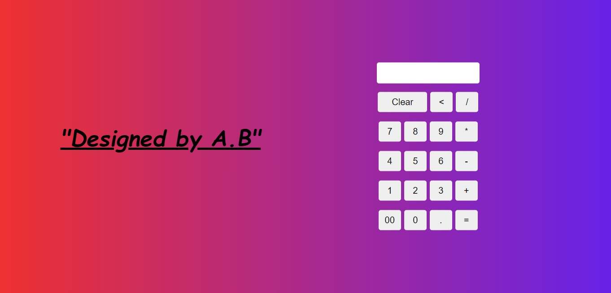

# Calculator
 A simple Calculator is to perform simple operation like Addition, Subtraction,  Multipication, Division.
 This calculator is made by using HTML and CSS.
 
 
 // Frontend of the Calculaor below--
------------------------------------------------------------------------------------------------------------------------------

Here is Output :- https://calculator.mutualstudy77.repl.co/

[click here] for the output(https://calculator.mutualstudy77.repl.co/)
